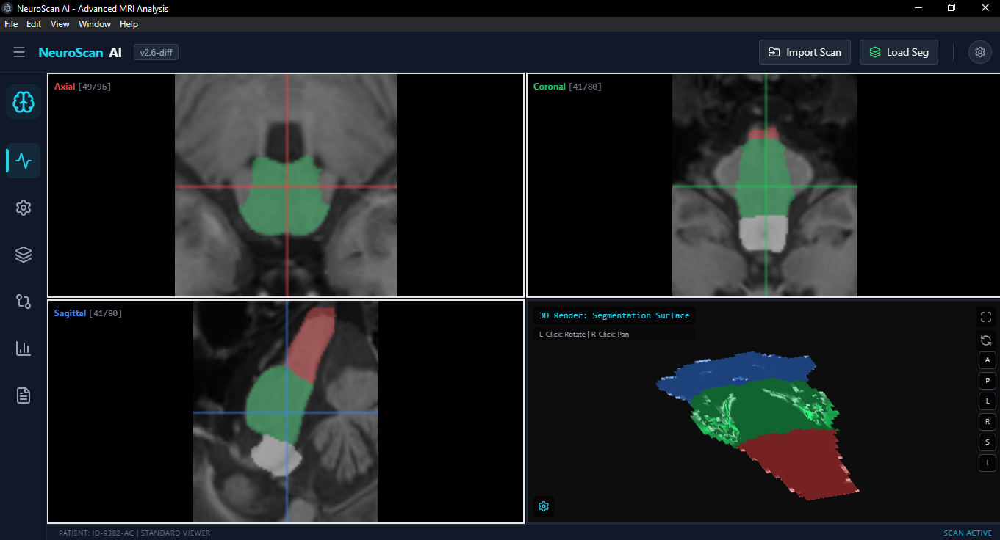

# 🧠 NeuroScan AI

<div align="center">



**Advanced MRI Analysis Desktop Application**

[]()
[](https://www.electronjs.org/)
[](https://reactjs.org/)
[](https://www.typescriptlang.org/)

</div>

---

## 📋 Overview

NeuroScan AI is a powerful desktop application for medical imaging analysis, specifically designed for viewing, processing, and analyzing MRI scans. Built with Electron and React, it provides a comprehensive suite of tools for medical professionals and researchers working with neuroimaging data.

### ✨ Key Features

- **📊 Multi-Format Support**: Import NIfTI (.nii, .nii.gz) and DICOM (.dcm, .ima) files
- **🔬 Advanced Visualization**: Multiple viewport modes (Four-Up, Axial, Sagittal, Coronal, 3D Rendering)
- **✂️ Image Processing**: Built-in tools for filtering, normalization, and enhancement
- **🎨 Segmentation Tools**: Manual and AI-assisted segmentation capabilities
- **📈 Quantitative Analysis**: Volumetric measurements and statistical analysis
- **🔄 Study Comparison**: Side-by-side comparison of baseline and follow-up scans
- **🤖 AI-Powered Reporting**: Integrated Google Gemini AI for automated report generation
- **💾 Cross-Platform**: Runs on Windows, macOS, and Linux

---

## 🚀 Getting Started

### Prerequisites

- **Node.js** (v18 or higher)
- **npm** or **yarn**

### Installation

1. **Clone the repository**:
   ```bash
   git clone https://github.com/robbinc91/neuroscan-ai
   cd neuroscan-ai
   ```

2. **Install dependencies**:
   ```bash
   npm install
   ```

3. **Configure Gemini API Key**:
   
   Create or edit the `.env.local` file in the project root:
   ```env
   GEMINI_API_KEY=your_api_key_here
   ```
   
   Get your API key from [Google AI Studio](https://ai.google.dev/).

4. **Run the application**:
   ```bash
   npm run dev
   ```

---

## 🛠️ Development Workflow

### Running in Development Mode

The application uses **Vite** with **hot module replacement (HMR)** for a fast development experience:

```bash
npm run dev
```

**Benefits:**
- ⚡ **Instant hot reload** - See changes immediately without manual refresh
- 🔄 **Auto-restart** - Electron process restarts when main process code changes
- 🐛 **Source maps** - Easy debugging with proper stack traces
- 🚀 **Fast startup** - Application launches in seconds

### Making Changes

| File Type | Hot Reload | Notes |
|-----------|------------|-------|
| React Components (`.tsx`) | ✅ Instant | Changes apply immediately |
| Styles (`.css`) | ✅ Instant | No page refresh needed |
| TypeScript Utils (`.ts`) | ✅ Instant | Fast compilation |
| Electron Main (`electron/main.ts`) | 🔄 Auto-restart | App restarts automatically |

> 💡 **Tip**: Keep `npm run dev` running while developing. You only need to rebuild for production when you're ready to distribute the application.

---

## 🏗️ Building for Production

### Build for All Platforms

```bash
npm run build
```

### Platform-Specific Builds

```bash
# Windows (NSIS installer)
npm run package:win

# macOS (DMG)
npm run package:mac

# Linux (AppImage)
npm run package:linux
```

Built applications will be available in the `release/` directory.

---

## 📖 Usage Guide

### Loading Medical Images

**Method 1: File Menu**
- Click "Import Scan" button in the header
- Select NIfTI or DICOM files from your file system

**Method 2: Drag & Drop**
- Simply drag and drop medical image files directly onto the application window

**Method 3: File Association**
- Double-click `.nii` or `.dcm` files to open them directly in NeuroScan AI (after installation)

### Navigation Tools

| Tool | Description |
|------|-------------|
| **Window/Level (W/L)** | Adjust image brightness and contrast |
| **Pan** | Move the image within the viewport |
| **Zoom** | Magnify or reduce the image view |
| **Brush** | Paint segmentation masks |
| **Eraser** | Remove segmentation regions |

### Workspace Modes

#### 🔍 **Viewer Mode**
Basic viewing and navigation of medical images with window/level adjustment.

#### ⚙️ **Processing Mode**
Apply image processing algorithms:
- Gaussian blur
- Edge detection
- Intensity normalization
- Histogram equalization
- Noise reduction

#### ✂️ **Segmentation Mode**
Create and edit segmentation masks:
- Manual segmentation tools
- Threshold-based segmentation
- Region growing
- AI-assisted segmentation

#### 📊 **Analysis Mode**
Perform quantitative analysis:
- Volume measurements
- Intensity statistics
- Region of interest (ROI) analysis
- Histogram visualization

#### 📝 **Reporting Mode**
Generate comprehensive reports:
- AI-powered findings generation
- Automated measurements
- Export to PDF
- Include viewport snapshots

#### 🔄 **Comparison Mode**
Compare multiple studies:
- Side-by-side viewing
- Difference mapping
- Overlay fusion
- Longitudinal analysis

---

## 🛠️ Technology Stack

### Core Technologies
- **Electron**: Cross-platform desktop framework
- **React**: UI component library
- **TypeScript**: Type-safe JavaScript
- **Vite**: Fast build tool and dev server

### Medical Imaging Libraries
- **nifti-reader-js**: NIfTI file parsing
- **daikon**: DICOM file parsing

### UI & Styling
- **Tailwind CSS**: Utility-first CSS framework
- **Lucide React**: Icon library
- **Recharts**: Data visualization

### AI Integration
- **@google/genai**: Google Gemini AI SDK

### Additional Tools
- **electron-store**: Persistent application settings
- **html2canvas**: Screenshot capture
- **jsPDF**: PDF report generation

---

## 📁 Project Structure

```
neuroscan-ai/
├── components/           # React components
│   ├── AnalysisPanel.tsx
│   ├── ComparisonPanel.tsx
│   ├── ProcessingPanel.tsx
│   ├── SettingsDialog.tsx
│   ├── Sidebar.tsx
│   └── Viewport.tsx
├── electron/             # Electron main process
├── services/             # Business logic services
├── utils/                # Utility functions
│   ├── dicomUtils.ts    # DICOM parsing
│   ├── imageProcessing.ts
│   └── niftiUtils.ts    # NIfTI parsing
├── App.tsx              # Main application component
├── types.ts             # TypeScript type definitions
├── constants.ts         # Application constants
└── index.tsx            # Application entry point
```

---

## ⚙️ Configuration

### Application Settings

Access settings via the gear icon in the top-right corner:
- **Gemini API Key**: Configure AI reporting
- **Display Preferences**: Adjust UI behavior
- **File Associations**: Manage default file handlers

### Electron Builder Configuration

The `package.json` includes build configurations for:
- Windows NSIS installer with file associations
- macOS DMG with proper categorization
- Linux AppImage

---

## 🔐 Privacy & Security

- All image processing is performed **locally** on your machine
- Medical images are **never uploaded** to external servers
- AI features (when used) send only anonymized image metadata to Google Gemini
- API keys are stored securely using `electron-store`

---

## 🐛 Troubleshooting

### Issue: Application won't start
- Ensure Node.js v18+ is installed
- Delete `node_modules/` and run `npm install` again

### Issue: Images won't load
- Verify file format is supported (.nii, .nii.gz, .dcm, .ima)
- Check file permissions
- Try using "Import Scan" instead of drag-and-drop

### Issue: AI features not working
- Verify `GEMINI_API_KEY` is set in `.env.local`
- Check your internet connection
- Verify API key is valid at [Google AI Studio](https://ai.google.dev/)

---

## 🤝 Contributing

Contributions are welcome! Please feel free to submit a Pull Request.

1. Fork the repository
2. Create your feature branch (`git checkout -b feature/AmazingFeature`)
3. Commit your changes (`git commit -m 'Add some AmazingFeature'`)
4. Push to the branch (`git push origin feature/AmazingFeature`)
5. Open a Pull Request

---

## 📄 License

This project is licensed under the MIT License - see the LICENSE file for details.

---

## 🙏 Acknowledgments

- Medical imaging libraries: nifti-reader-js, daikon
- Google Gemini AI for intelligent reporting capabilities
- The open-source community for excellent tools and libraries

---

## 📞 Support

For issues, questions, or suggestions:
- 🐛 [Report a Bug](https://github.com/yourusername/neuroscan-ai/issues)
- 💡 [Request a Feature](https://github.com/yourusername/neuroscan-ai/issues)
- 📧 Email: your.email@example.com

---

<div align="center">

**Made with ❤️ for the medical imaging community**

</div>
